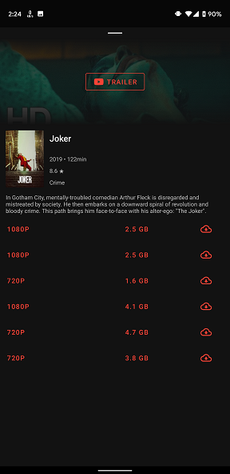
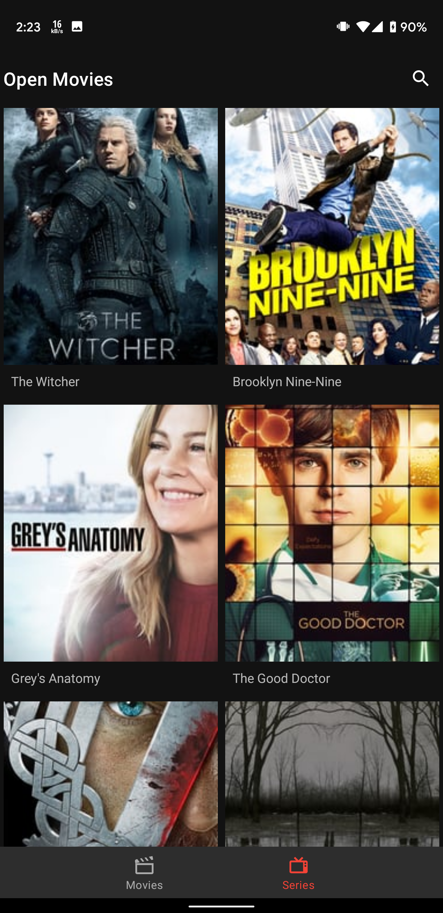

OpenMovies
--------------

Android MVVM, Kotlin, Room movies torrent listing client

Pre-requisites
--------------

- Android Studio 3.x

Getting Started
---------------

This sample uses the Gradle build system. To build this project, use the
"gradlew build" command or use "Import Project" in Android Studio.
